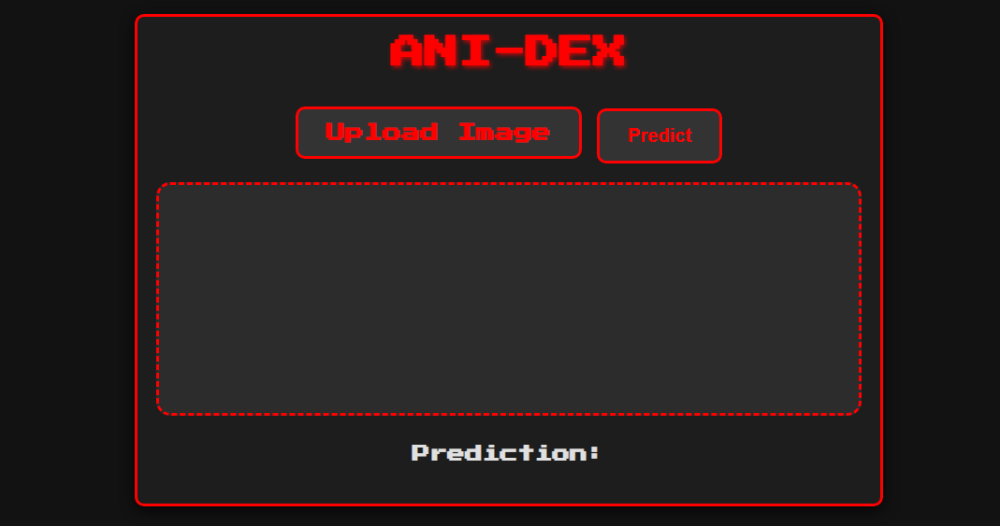
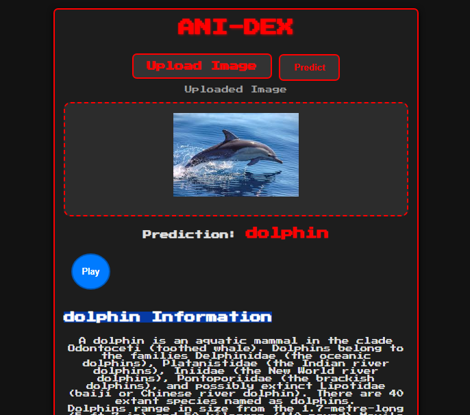

# Anidex – The Real-Life Pokedex 🦁🐍🐧

🚀 **Identify animals using AI and learn more about them with Anidex!**

## 📌 Overview
Anidex is an **AI-powered animal identifier** that uses **Deep Learning (CNNs)** to classify animals from images. Once identified, Anidex fetches detailed information about the animal from Wikipedia, providing an educational and fun experience.

Anidex works similarly to a **Pokedex**, but for animals! 🦁🐍🐧

## 📝 Dataset
The model is trained on **90 animal classes**, including animals like:
- **Mammals**: Lion, Tiger, Elephant
- **Reptiles**: Snake, Lizard
- **Birds**: Parrot, Penguin
- **Others**: Fish, Amphibians, and more!

## ⚙️ Technologies Used
- **Python**
- **Flask** (for Backend)
- **Inception Model** (Pre-trained CNN for Image Classification)
- **Wikipedia API** (for fetching animal information)
- **HTML, CSS, JavaScript** (for Frontend)
- **Speech-to-Text** (for reading out animal details)

## 🔥 Model Performance
✅ **Accuracy:** 84% (with room for improvement)
✅ **Works with 90 animal classes**
✅ **Handles animal image classification efficiently**

## 🖥 Installation
1. Clone the repository:
   ```bash
   git clone https://github.com/yourusername/anidex.git
   cd anidex
   ```
2. Install dependencies:
   ```bash
   pip install -r requirements.txt
   ```
3. Run the Flask app:
   ```bash
   python app.py
   ```

## 🚀 Usage
1. Open the web app in your browser: **http://127.0.0.1:5000/**
2. Upload an animal image
3. Anidex will classify the animal and show detailed information (with text and image from Wikipedia)
4. Optionally, click the **Speech Button** to hear the animal's details!

## 📸 Screenshots
### **🏠 Home Page**


### **📊 Prediction Result**
_When clicking on "Predict" button:_


## 🛑 Disclaimer:
Anidex is trained on **90 animal classes**. Please upload images of animals for accurate results. If you upload a human or random image, the model may misclassify it as an animal.

## 📜 License
This project is open-source under the MIT License.
